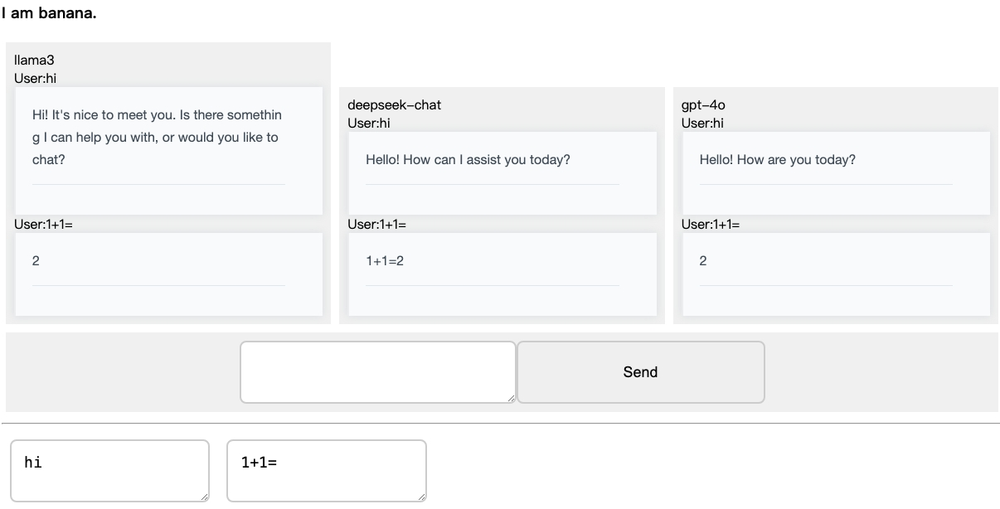

# GPTs Chat App 

## Overview

This is a chat application that allows users to interact with multi AIs through a simple and intuitive interface. There is also a human channel chat feature that needs a bug fix. You might consider switching to Tailwind CSS for styling. This repository is intended for learning purposes only.

Thanks for open source with cherry-markdown htmx hono bun mitata openai


## Features

- Real-time chat with multi AIs or humans using GPT models.
- Customizable models and settings.
- markdown view
- Responsive design for various devices.

## Installation

To install the dependencies, run:

```sh
bun install
```

## Usage

To run the application, execute:

```sh
bun run dev
```

Open your browser and navigate to `http://localhost:3000` to start chatting.

## Configuration

Modify the models API in `src/api/models.ts` to customize the AI behavior.

## Directory Structure

The project directory is organized as follows:
- [static/](./static):
  - [index.html](./static/index.html): Main HTML file for the application. have   htmx and js logic.
- [src/](./src):  
  - [index.tsx](./src/index.tsx): Entry point of the application, core server logic.
  - [GptChat.tsx](./src/GptChat.tsx): Component for the GPT chat interface.
  - [models.tsx](./src/models.tsx): Configuration for the AI models.
  - [benmarking.tsx](./src/benmarking.tsx): Benchmarking scripts for performance testing gpt models.
  - [HumanChat.tsx](./src/HumanChat.tsx): Component for human-to-human chat interface. have bug
 

This structure ensures a clear separation of concerns and easy navigation through the project files.

## Contributing

Pull requests are welcome. For major changes, please open an issue first to discuss what you would like to change.

## License

[MIT](https://choosealicense.com/licenses/mit/)
